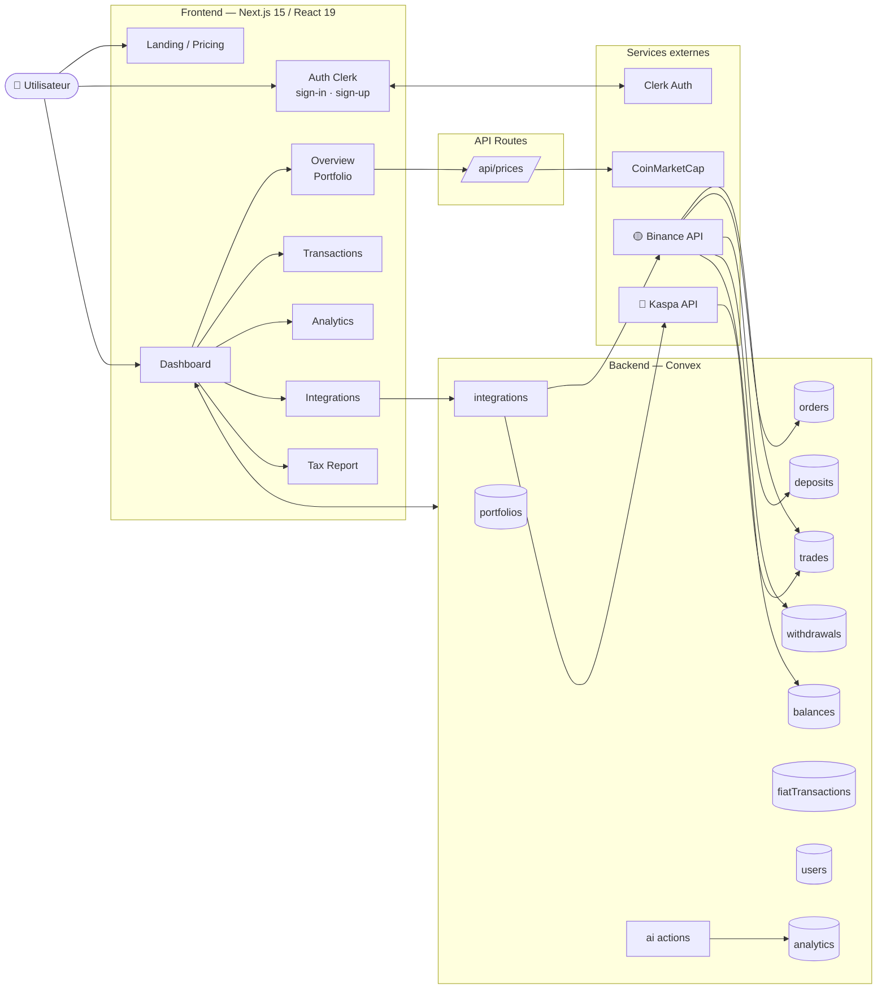

<div align="center">

# Hashory

**Tous vos actifs crypto — exchanges, wallets on-chain et imports de fichiers — dans un seul terminal.**

Agrégation de portefeuille, calcul de P&L, analyse de saisonnalité et déclaration fiscale française,
en open source et en lecture seule.

[](https://nextjs.org)
[](https://react.dev)
[](https://convex.dev)
[](#licence)

</div>

---

## Ce que fait Hashory

- **Agrège vos sources.** Binance et KuCoin via API en lecture seule ; Bitcoin, Ethereum, Solana,
  Kaspa et Bittensor via adresse publique ; Bitstack et Finary via import CSV.
- **Reconstitue votre historique.** Trades, conversions, dépôts, retraits, ordres, soldes et
  poussière — l'intégralité de votre activité, sans ressaisie.
- **Calcule votre performance.** P&L par actif, par période et par plateforme, prix de revient
  moyen, répartition et évolution de la valeur du portefeuille.
- **Prépare votre déclaration.** Plus-values de cession d'actifs numériques calculées selon
  l'article 150 VH bis du CGI, avec le détail cession par cession.
- **Analyse la saisonnalité.** Le comportement de vos actifs mois par mois, pour situer votre
  performance dans le cycle.

> **Sécurité par conception.** Hashory ne demande que des accès en **lecture seule**. Les clés API
> sont chiffrées avant stockage, les wallets sont suivis via leur adresse publique uniquement.
> Aucun chemin technique ne permet de déplacer vos fonds.

## Architecture



## Stack

| Couche | Technologie |
| --- | --- |
| Framework | Next.js 15 (App Router), React 19, TypeScript |
| Styles | Tailwind CSS v4, Radix UI, composants shadcn/ui |
| Backend & base | Convex (fonctions, requêtes temps réel, actions) |
| Authentification | Clerk |
| Graphiques | Recharts |
| Hébergement | Vercel |

## Démarrage

**Prérequis :** Node.js 20+, un compte [Convex](https://convex.dev) et un compte
[Clerk](https://clerk.com).

```bash
# 1. Installer les dépendances
npm install

# 2. Configurer l'environnement
cp .env.example .env.local   # puis renseignez vos clés

# 3. Lancer le backend Convex (dans un terminal dédié)
npm run convex:dev

# 4. Lancer l'application
npm run dev
```

L'application est disponible sur [http://localhost:3000](http://localhost:3000).

### Variables d'environnement

Toutes les variables sont documentées dans [`.env.example`](.env.example). Les indispensables :

| Variable | Rôle |
| --- | --- |
| `NEXT_PUBLIC_CLERK_PUBLISHABLE_KEY` / `CLERK_SECRET_KEY` | Authentification Clerk |
| `NEXT_PUBLIC_CONVEX_URL` / `CONVEX_DEPLOYMENT` | Déploiement Convex |
| `CLERK_JWT_ISSUER_DOMAIN` | Vérification du jeton côté Convex |
| `ORACLY_ENCRYPTION_KEY` | Clé de chiffrement des identifiants d'exchange (32 caractères) |
| `CMC_API_KEY` | Prix et métadonnées CoinMarketCap |
| `NEXT_PUBLIC_SITE_URL` | URL publique, pour les métadonnées et le sitemap |

## Scripts

| Commande | Effet |
| --- | --- |
| `npm run dev` | Serveur de développement Next.js |
| `npm run convex:dev` | Backend Convex en mode watch |
| `npm run build` | Build de production |
| `npm run start` | Serveur de production |
| `npm run lint` | ESLint |
| `npx tsc --noEmit` | Vérification des types |

## Déploiement

Hashory est conçu pour être auto-hébergeable. Le plus simple est
[Vercel](https://vercel.com/new) : importez le dépôt, renseignez les mêmes variables
d'environnement, et déployez votre backend Convex avec `npx convex deploy`.

## Contribuer

Les contributions sont bienvenues — en particulier les nouvelles intégrations d'exchanges et de
blockchains. Les messages de commit suivent la convention
[Conventional Commits](https://www.conventionalcommits.org/fr/) : le changelog et les versions sont
générés automatiquement par release-please.

## Licence

MIT.
